# BOOKSY 

Have there been times when you wanted to read some your favourite books but couldn't because of its unavailability or any other reasons.

Do not feel low, We have got you all covered, we present to you BOOKSY a simple book lending and borrowing app. This app allows you to search any book that you want and it allows to borrow your favourite book. On addition to this, you yorself can lend your books to fellow Bibliophiles and as we all know that *Happiness is in lending a book to someone who absolutely adores reading*.

This app provides you to exchange books as easily as clapping your hands. It is supported with a simple yet effecient interface and UX design to help you read your desired book and also connect to different people having the same interest as you. 

## Screen Recording
Screen recording can be found [here](https://drive.google.com/file/d/19AwkGjmp-Y0OWd-jOR0EDBAEgKD8LqIl/view?usp=drivesdk)

## Screenshots
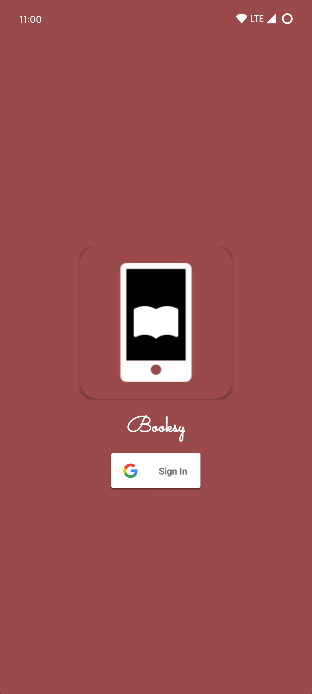
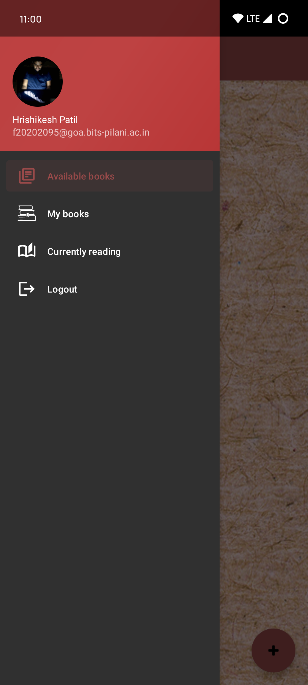

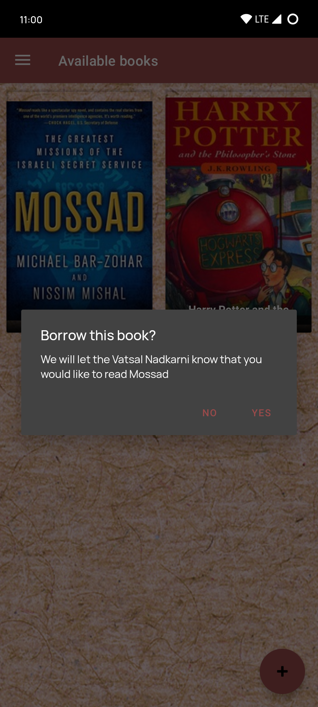
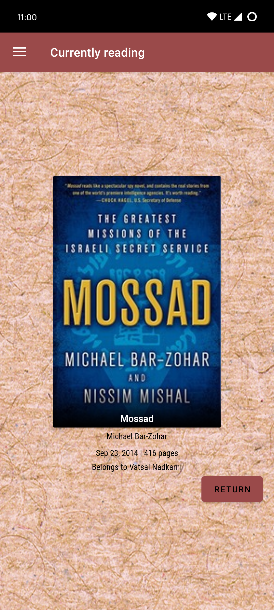
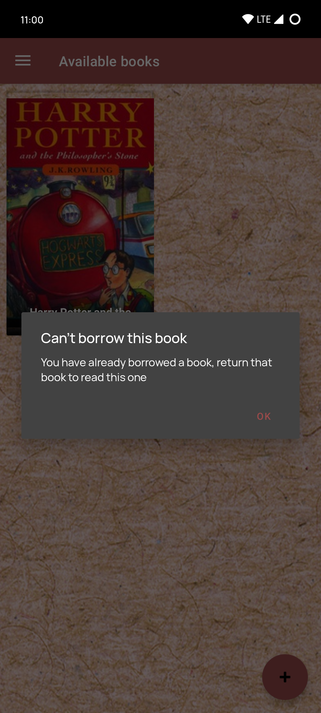
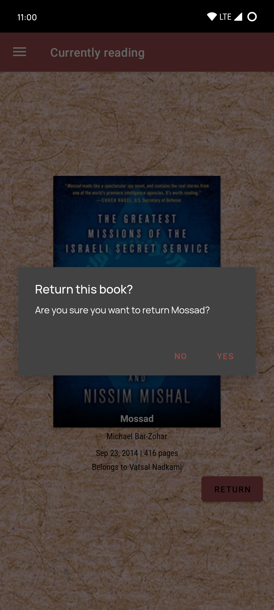
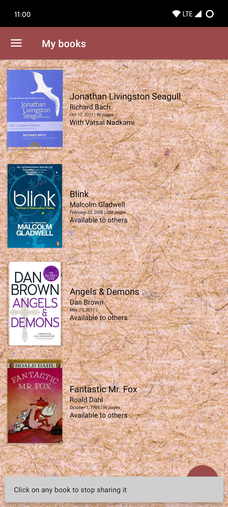
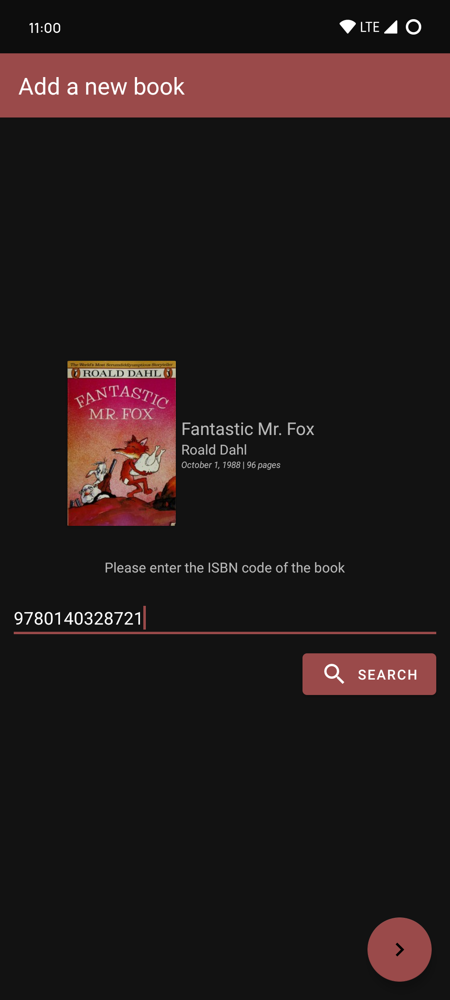
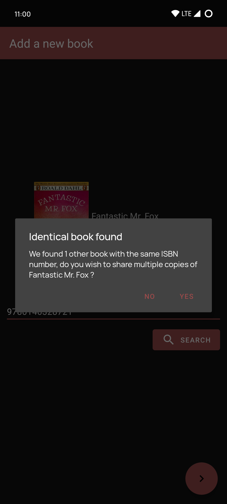
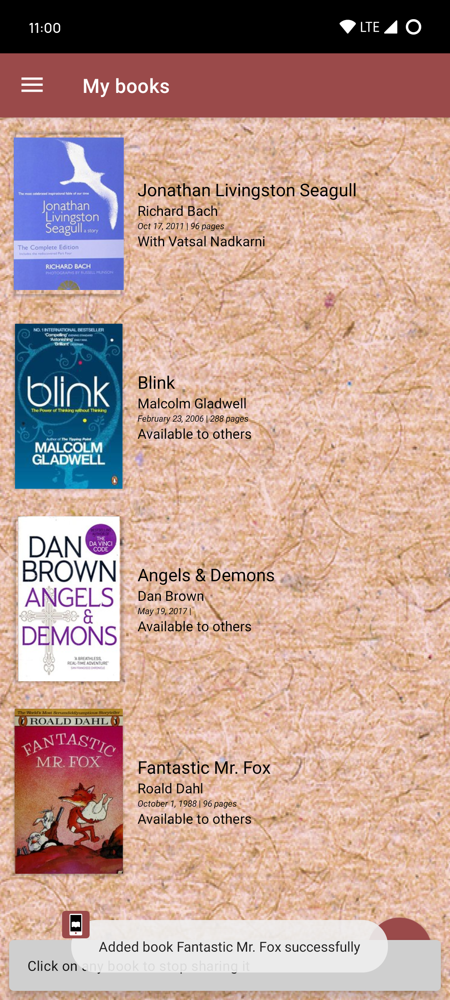
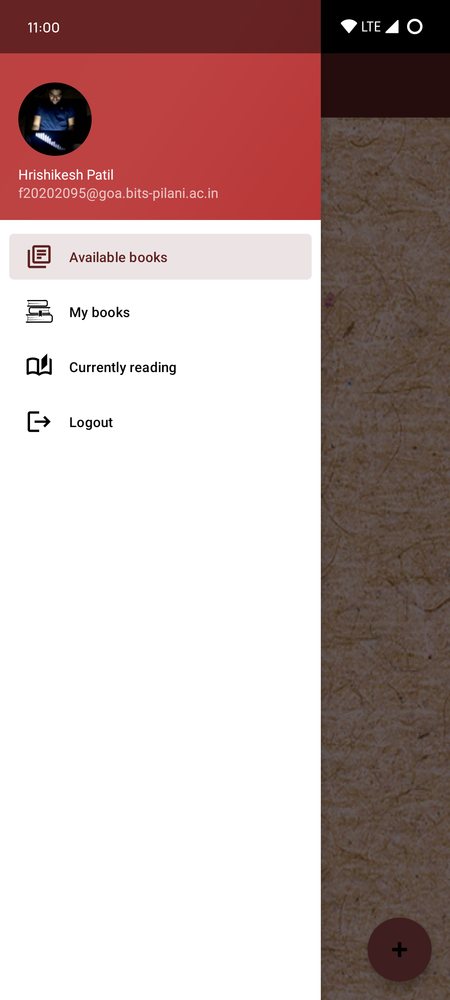
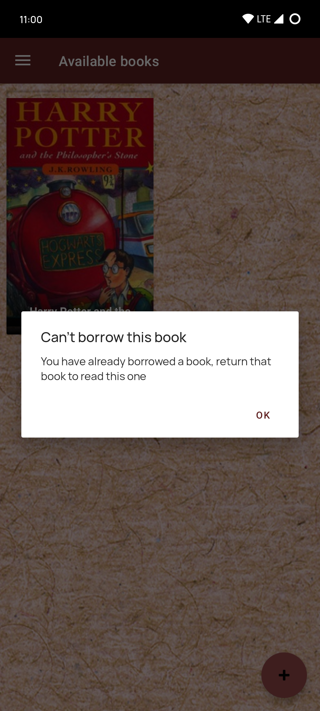
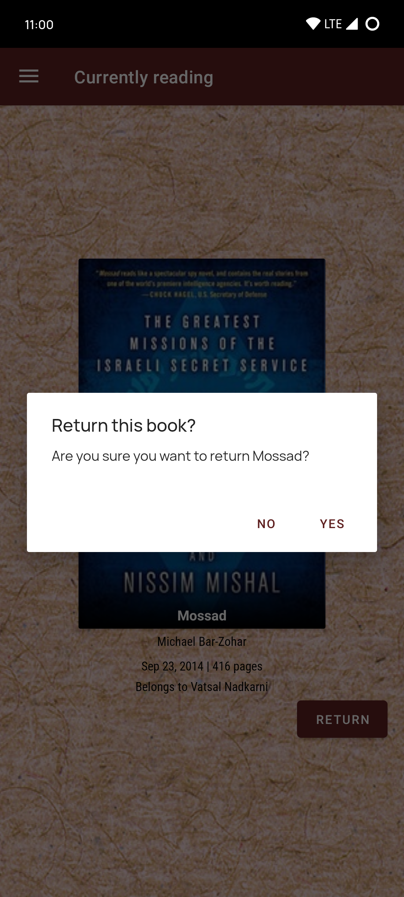
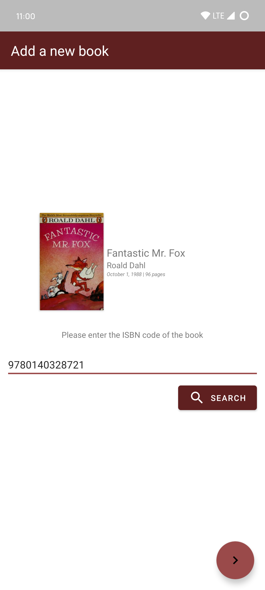